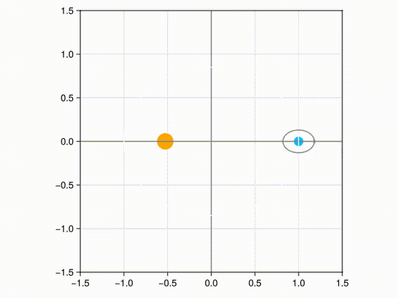

# Simulaciones orbitales en Julia

Este proyecto contiene un script en Julia para visualizar una simulación simplificada del sistema Tierra-Luna alrededor del Sol usando GLMakie.

## ¿Qué hace?

El script genera una animación en la que se muestran:

- un Sol fijo en el centro,
- la órbita terrestre elíptica,
- la Luna orbitando alrededor de la Tierra,
- un punto rojo que representa el baricentro simplificado de la Tierra y la Luna.

La salida se guarda como un archivo de video en formato MP4.

## Requisitos

- Julia 1.9 o superior
- Paquete GLMakie

## Instalación

Desde Julia, ejecuta:

```julia
using Pkg
Pkg.add("GLMakie")
```

## Ejecución

En la carpeta del proyecto, ejecuta:

```bash
julia orbita_circular.jl
```

Esto generará este video:

<p align="center">
  
</p>

## Estructura del proyecto

- [orbita_circular.jl](sistema_orbital.jl): script principal con la simulación y la animación.
- [README.md](README.md): documentación del proyecto.

## Notas

El código está pensado como una demostración visual y educativa, no como una simulación física completa o precisa.
